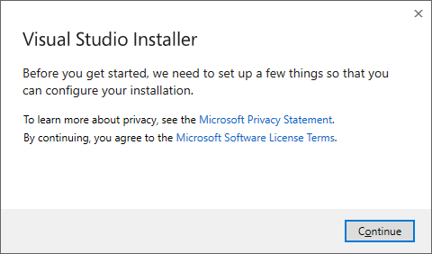
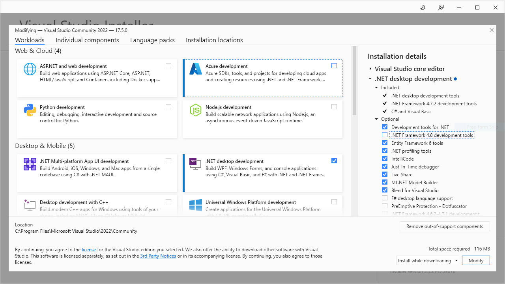
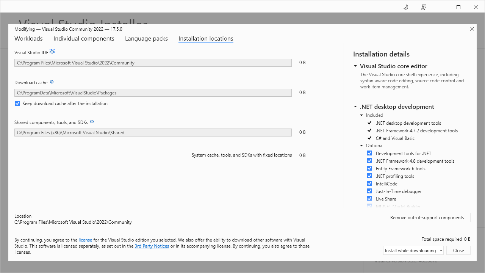
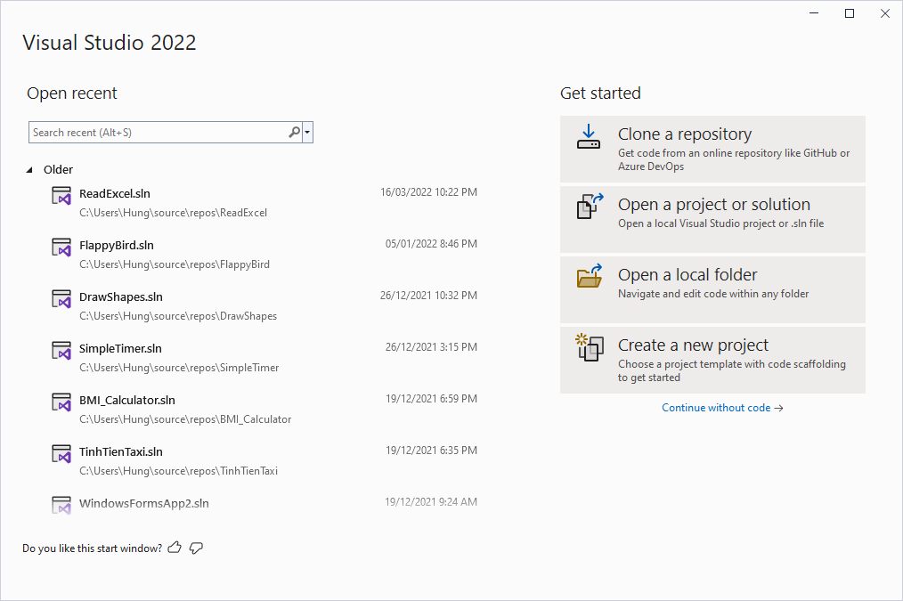
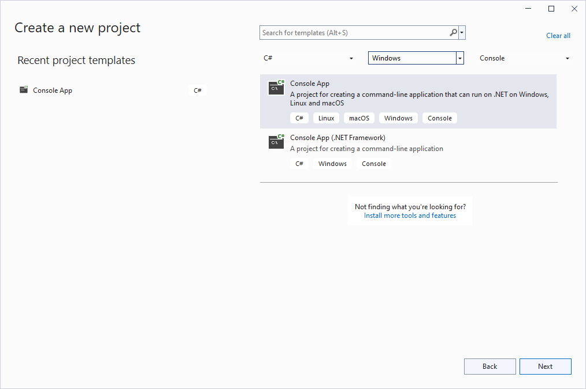
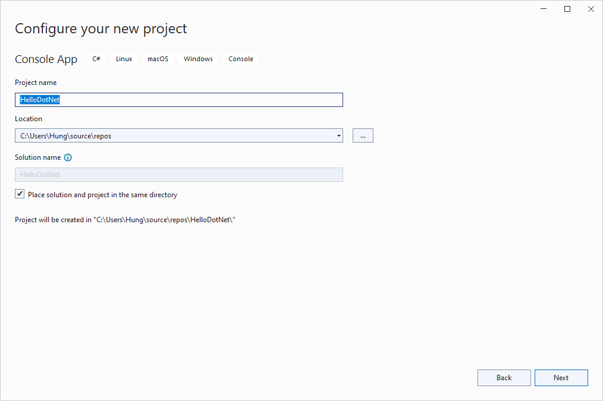
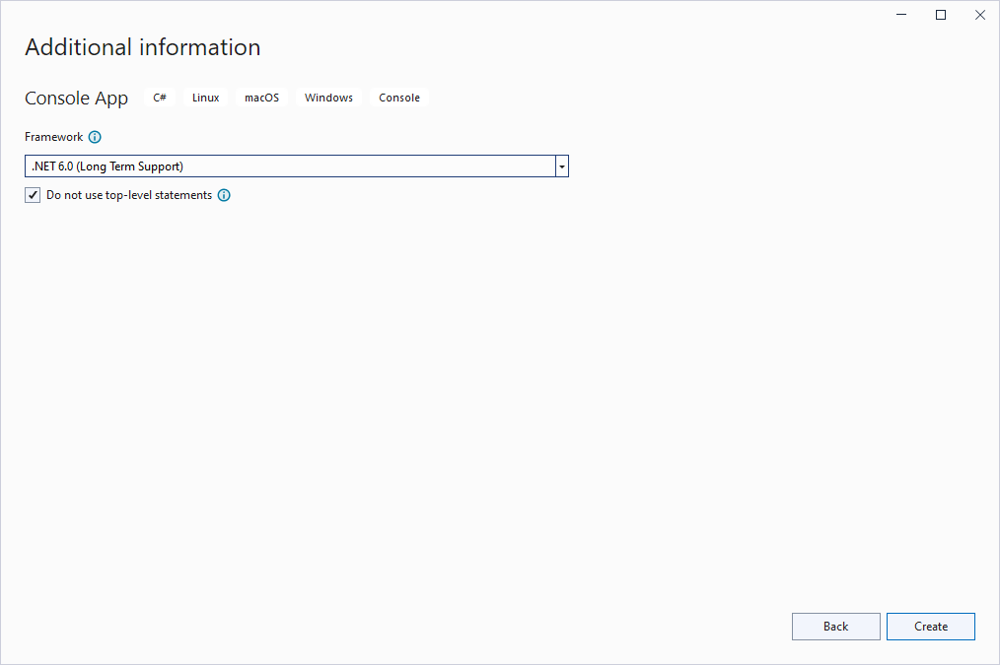
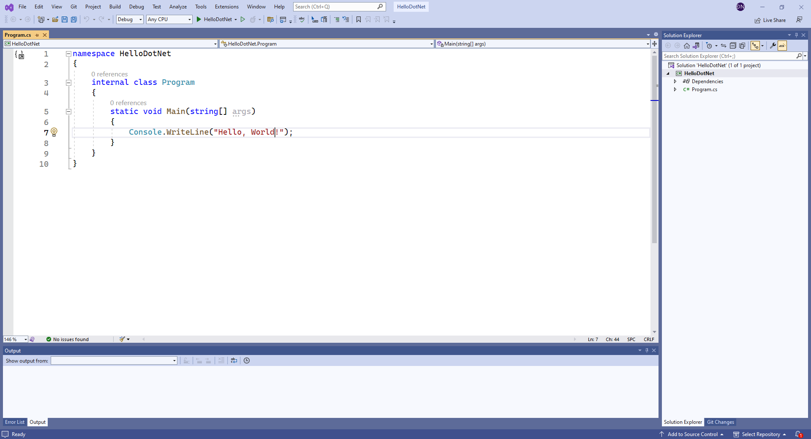
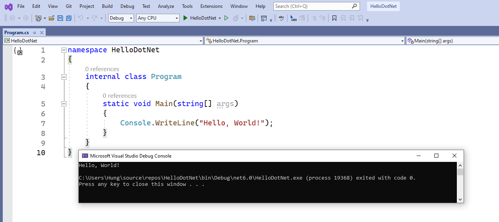

# Cài đặt Microsoft Visual Studio

---

## Sơ lược về Visual Studio

>Micosoft Visual Studio là môi trường phát triển tích hợp (IDE) có đầy đủ tính năng dùng cho phát triển đa dạng các ứng dụng trên môi trường Windows, iOS, Android, ứng dụng web và dịch vụ đám mây (cloud services).

>Có 3 phiên bản Visual Studio: Community, Professional, Enterprise. Trong đó bản Community miễn phí, cung cấp đầy đủ tính năng đối với người dùng cá nhân.

## Cài đặt Visual Studio Community 2022

([Xem hướng dẫn cài đặt từ Microsoft](https://learn.microsoft.com/en-us/visualstudio/install/install-visual-studio?view=vs-2022))

- [Tải chương trình cài đặt bản Community](https://visualstudio.microsoft.com/vs/community/)
- Mở file vừa tải xuống (có tên là `VisualStudioSetup.exe`) để tiến hành cài Visual Studio.
- Chọn **Continue** để đồng ý thỏa thuận giấy phép phần mềm với Microsoft

- Chọn công cụ phù hợp với loại ứng dụng (workloads) cài đặt. Chỉ nên chọn thành phần cần thiết, ví dụ `.NET desktop development` để tạo các ứng dụng console, Windows Forms,... với .NET và .NET Framework.

- Chọn các thành phần cài đặt

- Chọn vị trí cài đặt

- Nhấn **Install** để tiến hành cài đặt Visual Studio.

## Tạo ứng dụng C# với Visual Studio

- Khởi động Visual Studio

Chọn **Create a new project** để tạo ứng dụng mới.

- Thiết lập ứng dụng

Chọn **Create a new project** để tạo ứng dụng mới.
Chọn loại project là **ConsoleApp** để tạo ứng dụng dạng giao tiếp dòng lệnh trên nền tảng .NET. 

- Đặt tên ứng dụng

- Chọn phiên bản .NET

Chọn *Do not use top-level statements* để tạo ứng dụng "chuẩn" với đầy đủ khai báo namespace, các lớp, hàm Main(). Nhấn **Create** để tạo ứng dụng.

- Viết code

- Chạy thử ứng dụng

Nhấn **Ctrl+F5**, hoặc chọn **Debug > Start without debugging**, hoặc nhấn nút **Start** (hình mũi tên màu xanh).

