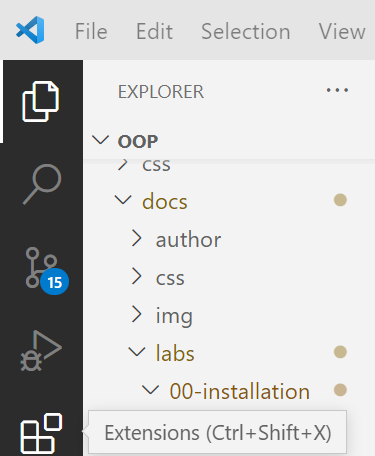
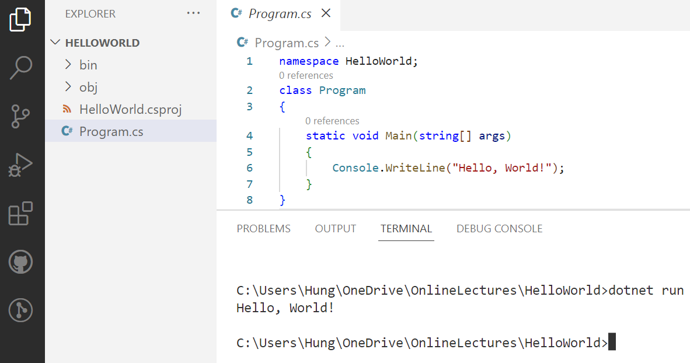

# Tạo ứng dụng C# với Visual Studio Code (VS Code)

---

## Sơ lược về VS Code

VS Code là công cụ viết mã nguồn được sử dụng phổ biến hiện nay do có nhiều tính năng mạnh, hỗ trợ đa nền tảng lại gọn nhẹ.

### Các đặc điểm chính của VS Code

- Nhiều tính năng cao cấp: gợi ý mã lệnh thông minh (IntelliSense code completion), quản lý phiên bản mã nguồn phân tán (Git).
- Khả năng mở rộng để lập trình với nhiều ngôn ngữ.
- Có thể chạy VS Code trên Windows, macOS và Linux.
- Miễn phí & mã nguồn mở.

> Chú ý: VS Code là công cụ viết mã nguồn (code editor), không phải là IDE đầy đủ. Để lập trình C# với VS Code, cần cài đặt thêm các công cụ sau:
> - Gói mở rộng (extension) hỗ trợ viết mã nguồn C#.
> - .NET SDK: VS Code hỗ trợ .NET 6, hoặc .NET Framework 4.5.2 trở lên.

## Cài đặt VS Code

- [Tải về bản cài đặt VS Code cho Windows, bản cài đặt người dùng (User)](https://go.microsoft.com/fwlink/?LinkID=534107).
- Mở file cài đặt vừa tải xuống (tên file dạng `VSCodeUserSetup-{version}.exe`, chẳng hạn version=`x64-1.61.2`).

- **License Agreement**: Chọn **I accept the agreement** và **Next**.


- **Ready to Install**: Chọn **Install**.


> Ở chế độ cài đặt người dùng (User), VS Code sẽ được cài mặc định ở `C:\users\{username}\AppData\Local\Programs\Microsoft VS Code`, với `username` là tên tài khoản người dùng.
> Muốn cài đặt VS Code cho tất cả người dùng, <a href="https://go.microsoft.com/fwlink/?linkid=852157">tải file cài đặt dành cho admin</a>. Khi đó VS Code sẽ được cài ở `Program Files`.

## Cài C# extension

- Khởi động VS Code.
- Chọn biểu tượng **Extensions** (Ctrl+Shift+X)



Tại ô tìm kiếm, nhập `C#`. Trong danh sách các extensions hiện ra, chọn gói "C# for Visual Studio Code (powered by OmniSharp)" của Microsoft và nhấn **Install**.


## Tạo ứng dụng .NET Console/C# với VS Code

### Yêu cầu

Đảm bảo máy tính đã được cài đặt các công cụ sau:

- .NET 6 trở lên.
- Visual Studio Code với C# extension.

### Tạo ứng dụng Console

- Khởi động Visual Studio Code.
- Chọn **File > Open Folder**.
- Trong hộp hội thoại **Open Folder**, tạo một thư mục mới đặt tên phù hợp với dự án, chẳng hạn `HelloWorld`


- Chọn **Select Folder** để tạo app trong thư mục vừa tạo. Nếu được hỏi `Do you trust the authors of the files in this folder?` thì chọn `Yes, I trust the authors`.
- Mở cửa sổ dòng lệnh (Terminal): Chọn **View > Terminal** hoặc nhấn **Ctrl + `**.  


- Trong cửa sổ Terminal, nhập lệnh sau:

```Console
dotnet new console --framework net6.0 --use-program-main
```

Lệnh `dotnet new console` tạo ứng dụng .NET console, tùy chọn `--framework net6.0` chọn phiên bản .NET. Nếu có tùy chọn `--use-program-main` thì VS Code tạo khuôn mẫu ứng dụng có sẵn lớp `Program` trong đó có hàm `Main`, nếu không có tùy chọn này thì VS Code tạo ứng dụng dạng `top-level statements`.

Trong trong file mã nguồn `Program.cs` VS Code tạo sẵn một lớp `Program`, trong đó có một phương thức `Main`. Khi chạy ứng dụng, các lệnh trong hàm `Main` sẽ được thực hiện.


VS Code tạo sẵn dòng lệnh in ra câu "Hello, World!".

### Chạy ứng dụng

- Tại dấu nhắc trong cửa sổ Terminal nhập lệnh sau để chạy ứng dụng:

```Console
dotnet run
```



## Liên kết VS Code với tài khoản GitHub

- Chọn biểu tượng "Extensions" (Ctrl+Shift+X), nhập Github vào ô tìm kiếm, chọn gói "GitHub Pull Requests and Issues" của Github và nhấn "Install".
- Thực hiện các bước theo [hướng dẫn từ VS Code](https://code.visualstudio.com/docs/sourcecontrol/github).

## Debug ứng dụng C#/.NET Console với VS Code

[Xem hướng dẫn debug từ Microsoft](https://learn.microsoft.com/en-us/dotnet/core/tutorials/debugging-with-visual-studio-code)
