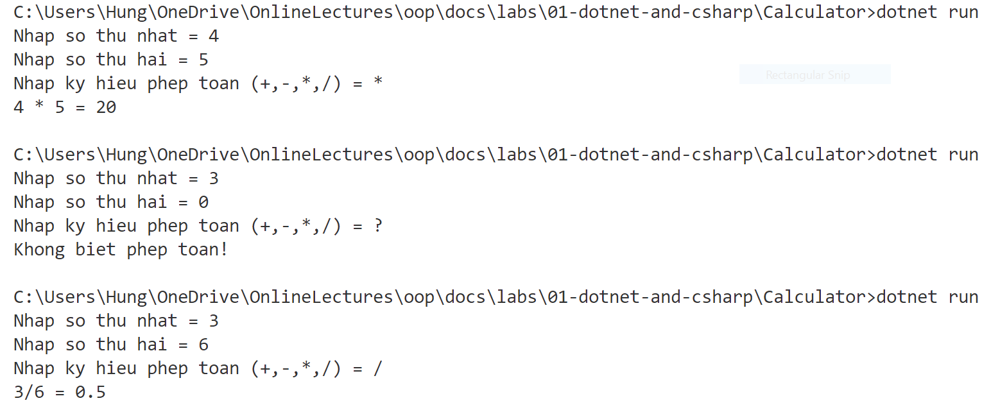

# Calculator

---

## Mục đích

Làm quen với nền tảng .NET và ngôn ngữ C#.

## Yêu cầu

Viết chương trình nhập từ bàn phím hai số nguyên a, b và một ký tự ch.

Nếu:
- ch là "+" thì thực hiện phép tính a + b và in kết quả lên màn hình.
- ch là "–" thì thực hiện phép tính a - b và in kết quả lên màn hình.
- ch là "*" thì thực hiện phép tính a * b và in kết quả lên màn hình.
- ch là "/" thì thực hiện phép tính a / b và in kết quả lên màn hình. Lưu ý kiểm tra điều kiện của phép chia.

## Ví dụ chạy chương trình

## Mã nguồn gợi ý

[Xem trên GitHub](https://github.com/nd-hung/oop/tree/main/docs/labs/01-dotnet-and-csharp/Calculator)

