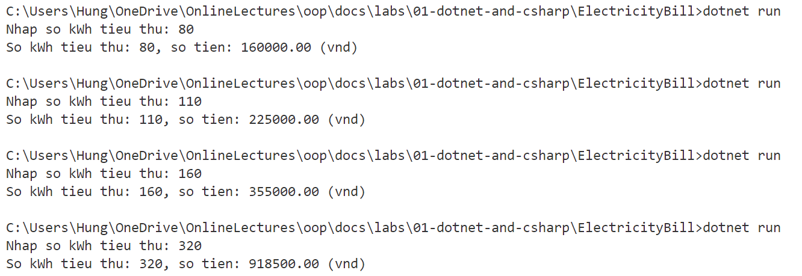

# Tính tiền điện 

---

## Yêu cầu

Viết chương trình tính tiền điện dựa vào số kWh tiêu thụ và bảng giá. 
## Input: 
- Số kWh tiêu thụ: Là số nguyên dương nhập từ bàn phím

- Bảng giá:

|Mức tiêu thụ|Đơn giá (đồng/kWh)|
|:----|:----|
|Mức 1: Cho kWh từ 0 - 100|2000|
|Mức 2: Cho kWh từ 101 - 150|2500|
|Mức 3: Cho kWh từ 101 trở đi |3000|

Nếu số kWh tiêu thụ vượt quá 300 thì cộng thêm 10% tổng tiền phải trả.

## Output: Số tiền phải thanh toán (đ)

## Ví dụ chạy chương trình

