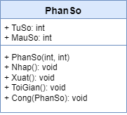

# Xử lý phân số

---

## Mục đích

- Vận dụng phương pháp lập trình HĐT cài đặt các xử lý cơ bản với phân số.

## Yêu cầu

### Cài đặt các lớp

- Cài đặt lớp phân số với các thành phần như mô hình sau.

### Chương trình chính

- Tạo một danh sách các phân số (có thể tạo danh sách tĩnh hoặc động).
- In ra danh sách phân số dạng tối giản.
- Tìm phân số lớn nhất, nhỏ nhất.
- Sắp xếp danh sách theo thứ tự tăng dần, in ra danh sách sau khi sắp xếp.

## Mã nguồn

[Xem trên GitHub](https://github.com/nd-hung/oop/blob/main/docs/labs/02-classes-and-objects/code/PhanSo/)