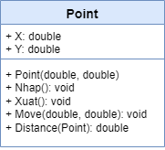

# Xây dựng lớp Point biểu diễn các điểm trong mặt phẳng

---

## Mục tiêu

- Giải quyết bài toán đơn giản theo phương pháp hướng đối tượng.

## Yêu cầu
### Cài đặt lớp Point mô tả các điểm trong mặt phẳng

#### Các thuộc tính
- Tọa độ X, Y
#### Các phương thức
- Thiết lập
- Nhập
- Xuất
- Di chuyển
- Tính khoảng cách đến một điểm khác

### Chương trình chính

- Tạo danh sách n điểm trong mặt phẳng.
- Tìm điểm gần/xa gốc tọa độ nhất.
- Tìm cặp điểm gần nhau/xa nhau nhất.

## Mã nguồn

[Xem trên GitHub](https://github.com/nd-hung/oop/tree/main/docs/labs/02-classes-and-objects/code/Point)