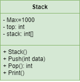

# Cài đặt cấu trúc ngăn xếp (Stack)
---

## Giới thiệu

Ngăn xếp (Stack) là cấu trúc dữ liệu lưu trữ danh sách các phần tử theo nguyên tắc "vào sau ra trước" (LIFO - last-in-first-out). Cấu trúc ngăn xếp có các ứng dụng quan trọng, như tính giá trị biểu thức đại số, quản lý lời gọi hàm,...

[Mô phỏng hoạt động của ngăn xếp trong môi trường đồ họa.](https://yongdanielliang.github.io/animation/web/Stack.html)

><a href="https://www.programiz.com/dsa/stack"></a>

## Mục đích

- Vận dụng phương pháp lập trình HĐT cài đặt cấu trúc ngăn xếp.
- Sử dụng cấu trúc ngăn xếp trong các bài toán:
    - Phân tích số tự nhiên ra thừa số nguyên tố.
    - Đổi số hệ thập phân sang hệ nhị phân, thập lục phân.
    - Tính giá trị biểu thức đại số.
- So sánh với lớp ngăn xếp dựng sẵn của C#.
  
## Yêu cầu
### Cài đặt lớp Stack 



**Các thuộc tính:**

- Max: số phần tử đối đa.
- top: chỉ số của phần tử trên cùng.
- stack: mảng chứa các phần tử.

**Các phương thức:**

- Thiết lập: khởi tạo ngăn xếp rỗng.
- Push(int data): thêm phần tử.
- Pop(): lấy ra phần tử trên cùng.
- Peek(): in ra phần tử trên cùng.
- IsEmpty(): kiểm tra ngăn xếp có rỗng hay không.
- Print(): in ra danh sách phần tử.

### Chương trình chính

- Phân tích một số nguyên > 1 thành thừa số nguyên tố, sau đó in ra các thừa số theo thứ tự ngược lại. Các thừa số được đẩy vào stack.

    Ví dụ:
```console
Input: 12
Output: 12 = 3 * 2 * 2
```

- Đổi một số nguyên sang hệ nhị phân, thập lục phân. Các số dư trong quá trình chia (trong kiểu số nguyên) được đẩy vào stack.

    Ví dụ:

```console
Input: 43
Output:
    Số 43 biểu diễn trong hệ nhị phân: 101011
    Số 43 biểu diễn trong hệ thập lục phân: 2B
```

## Mã nguồn

[Xem trên GitHub](https://github.com/nd-hung/oop/tree/main/docs/labs/02-classes-and-objects/code/Stack/)
