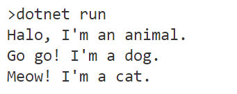

# Cài đặt đa hình

---

## Mục tiêu

- Vận dụng kỹ thuật đa hình trong cài đặt thừa kế.

## Mã nguồn

[Xem trên GitHub](https://github.com/nd-hung/oop/tree/main/docs/labs/04-polymorphism/code/Animal)

```c#
namespace PolymorphismDemo
{
    // Tạo lớp tổng quát Animal
    public class Animal
    {
        // Cài đặt phương thức ảo cho lớp tổng quát
        // Lưu ý sử dụng từ khóa virtual
        public virtual void Speak()
        {
            Console.WriteLine("Halo, I'm an animal.");
        }
    }

    // Tạo lớp Dog kế thừa lớp Animal
    class Dog : Animal
    {
        // Viết lại phương thức Speak phù hợp với lớp Dog
        // Lưu ý sử dụng từ khóa override
        public override void Speak()
        {
            Console.WriteLine("Go go! I'm a dog.");
        }
    }

    // Tạo lớp Cat kế thừa lớp Animal
    class Cat : Animal
    {
        // Viết lại phương thức Speak phù hợp với lớp Cat
        // Lưu ý sử dụng từ khóa override
        public override void Speak()
        {
            Console.WriteLine("Meow! I'm a cat.");
        }
    }

    // Chương trình chính
    internal class Program
    {
        static void Main(string[] args)
        {
            Animal myAnimal = new Animal();  // Tạo đối tượng của lớp cơ sở Animal
            Animal myDog = new Dog();        // Tạo đối tượng của lớp dẫn xuất Dog
            Animal myCat = new Cat();        // Tạo đối tượng của lớp dẫn xuất Cat

            // Cả 3 đối tượng trên đều gọi phương thức cùng tên,
            // nhưng cách xử lý của các phương thức này khác nhau:
            myAnimal.Speak();
            myDog.Speak();
            myCat.Speak();
        }
    }
}
```

## Chạy chương trình

