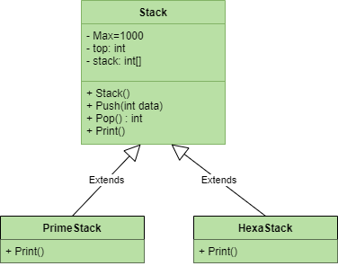

# Cấu trúc Stack - Version 2.0

## Đặt vấn đề

- Ở [Lab 2 - Lớp và Đối tượng](https://github.com/nd-hung/oop/tree/main/docs/labs/02-classes-and-objects/code/Stack/) đã xây dựng lớp ngăn xếp (Stack) version 1.0, trong đó các đối tượng của lớp Stack được sử dụng cho 2 bài toán khác nhau: phân tích thừa số nguyên tố và đổi số thập phân (decimal) sang hệ 16 (Hexa).

- Do đặc điểm của mỗi bài toán, phương thức in ra các giá trị trong ngăn xếp cần phải được cài đặt phù hợp. Ví dụ, với số tự nhiên n = 12, bài toán phân tích thừa số cần in ra tích `3*2*2`, còn với bài toán đổi sang hệ 16 cần in ra ký số `C`. Để giải quyết yêu cầu này, trong lớp Stack version 1.0 phải cài đặt hai phương thức có tên riêng biệt: Print() và PrintHex(). Điều này dẫn đến sự thiếu thống nhất trong việc gọi phương thức xuất dữ liệu, cho dù hành vi của chúng là giống nhau.

> **Câu hỏi: có thể viết phương thức có tên chung là Print() sao cho nó có khả năng tùy biến in ra dữ liệu phù hợp với mỗi trường hợp cụ thể hay không?**

- Vấn đề này có thể giải quyết bằng kỹ thuật thừa kế và đa hình.

## Mục tiêu

- Vận dụng tính đa hình trong kỹ thuật thừa kế để cài đặt cấu trúc ngăn xếp, cho phép các đối tượng khi gọi phương thức có cùng tên là Print() nhưng sẽ in ra dữ liệu phù hợp với tình huống.

## Yêu cầu

### Cài đặt lớp cơ sở Stack

#### Các thuộc tính:

- Max, top, data: như version 1.

#### Các phương thức:

- Thiết lập, Push, Pop: như version 1.
- Print(): cài đặt thành phương thức ảo (virtual method).

### Cài đặt lớp dẫn xuất PrimeStack cho bài toán phân tích thừa số nguyên tố

#### Các thuộc tính:

- Max, top, data: kế thừa lớp cơ sở.

#### Các phương thức:

- Thiết lập, Push, Pop: kế thừa lớp cơ sở.
- Print(): cài đặt thành phương thức ghi đè (override method) để in ra dãy thừa số nguyên tố.

### Cài đặt lớp dẫn xuất HexaStack cho bài toán đổi số thập phân sang hệ 16

#### Các thuộc tính:
- Max, top, data: kế thừa lớp cơ sở.

#### Các phương thức:

- Thiết lập, Push, Pop: kế thừa lớp cơ sở.
- Print(): cài đặt thành phương thức ghi đè (override method) để in ra biểu diễn của số thập phân trong hệ 16.

## Mã nguồn

[Xem trên GitHub](https://github.com/nd-hung/oop/blob/main/docs/labs/04-polymorphism/code/Stack2)