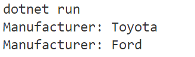

# Lớp và đối tượng

Classes and Objects

---

Hai khái niệm cơ bản của lập trình hướng đối tượng là lớp và đối tượng. Phần này tóm lược kỹ thuật cài đặt và sử dụng lớp và đối tượng với C#.

## Cài đặt lớp

- Cú pháp

```csharp
[Thuộc tính truy cập] class <Tên lớp>
{
    // Khai báo các thuộc tính và phương thức
}
```

## Thiết lập tính bao đóng

Thuộc tính truy cập (access modifier) thể hiện mức độ che chắn đến lớp và các thành viên của lớp.

**public**: Mức độ này cho phép truy cập đến lớp hoặc thành viên của lớp (thuộc tính, phương thức) trong cùng một assembly (là tập hợp các khai báo và tài nguyên tạo thành một file thi hành được (.exe hoặc .dll)), hoặc từ một assembly khác tham chiếu đến nó.

Khi một thành viên của lớp có thuộc tính truy cập là public thì mức độ truy cập đến thành viên đó được xác định bằng thuộc tính truy cập của lớp.

Ví dụ:

```cs
// Khai báo lớp mô tả loài chó
public class Dog
{
    public string Name;
}

// Chương trình chính
class Program
{
    static void Main(string[] args)
    {
        // Tạo đối tượng của lớp
        Dog dog = new Dog();
        // Thay đổi giá trị thuộc tính
        dog.Name = "Cau Vang";
        // Đọc thuộc tính
        Console.WriteLine("The dog's name is " + dog.Name);
    }
}
```

Trong đoạn code trên, lớp `Dog` được khai báo là `public`, thuộc tính `Name` cũng được khai báo `public`. Vì thế, các dòng lệnh trong lớp `Program` có thể sử dụng lớp `Dog` và có toàn quyền truy cập (đọc/ghi) đến thuộc tính `Name`.

- **private**: Chỉ có thể truy xuất đến lớp và thành viên của lớp từ bên trong lớp đó.

Trong ví dụ trên, nếu đổi mức độ truy cập của lớp `Dog` thành `private` thì khi biên dịch, lệnh `Dog dog = new Dog()` sẽ báo lỗi là `'Dog' is inaccessible due to its protection level` và lệnh `dog.Name = "Cau Vang"` sẽ báo lỗi `Dog.Name' is inaccessible due to its protection level`.

Nếu đổi mức độ truy cập của lớp `Dog` thành `public` và của thuộc tính `Name` thành `private` thì khi biên dịch, lệnh `Dog dog = new Dog()` hợp lệ, nhưng lệnh `dog.Name = "Cau Vang"` sẽ báo lỗi `'Dog.Name' is inaccessible due to its protection level`.

- **protected**: Có thể truy xuất đến lớp và thành viên của lớp từ bên trong lớp đó hoặc từ lớp thừa kế nó.

- **internal**: Chỉ có thể truy xuất đến lớp và thành viên của lớp từ bên trong một assembly.

- **protected internal**: Có thể truy xuất đến lớp và thành viên của lớp từ bên trong assembly, hoặc từ một lớp thừa kế nó nằm trong một assembly khác.

- **private protected**: Chỉ có thể truy xuất đến lớp và thành viên của lớp từ lớp thừa kế trong cùng một assembly.

## Cài đặt trường (field), thuộc tính (property)
Ngôn ngữ C# cung cấp tính năng cho phép thiết lập ràng buộc lên dữ liệu một cách chặt chẽ. Theo đó, dữ liệu của lớp được khai báo là biến thành viên gọi là trường (field). Các trường dữ liệu thường được thiết lập mức truy cập là `private` để chỉ cho phép truy xuất đến từ bên trong lớp. Khi muốn cung cấp chức năng truy xuất đến các trường dữ liệu từ bên ngoài một cách có kiểm soát, ta cài đặt thuộc tính - một cấu trúc kết hợp đặc điểm của cả trường dữ liệu và phương thức.

Một thuộc tính 


Properties combine aspects of both fields and methods. To the user of an object, a property appears to be a field; accessing the property requires the same syntax. To the implementer of a class, a property is one or two code blocks, representing a get accessor and/or a set or init accessor. The code block for the get accessor is executed when the property is read; the code block for the set or init accessor is executed when the property is assigned a value. A property without a set accessor is considered read-only. A property without a get accessor is considered write-only. A property that has both accessors is read-write. You can use an init accessor instead of a set accessor to enable the property to be set as part of object initialization but otherwise make it read-only.

Unlike fields, properties aren't classified as variables. Therefore, you can't pass a property as a ref or out parameter.

Properties have many uses:

They can validate data before allowing a change.
They can transparently expose data on a class where that data is retrieved from some other source, such as a database.
They can take an action when data is changed, such as raising an event, or changing the value of other fields.
Properties are declared in the class block by specifying the access level of the field, followed by the type of the property, followed by the name of the property, and followed by a code block that declares a get-accessor and/or a set accessor. For example

## Tạo, sử dụng và hủy đối tượng

### Tạo đối tượng

- Cần tạo đối tượng trước khi sử dụng.

- Cú pháp

```c#
<Tên lớp> <Tên đối tượng> = new <Tên lớp>([<Các tham số khởi tạo>]);
```

- Có thể xem lớp là kiểu dữ liệu tự định nghĩa, và mỗi đối tượng là một biến thuộc kiểu dữ liệu đó.
- Có thể tạo nhiều đối tượng của cùng một lớp, hoặc tạo mảng hoặc tập hợp các đối tượng.
- Có thể tạo đối tượng kết hợp với khởi tạo các thuộc tính cho nó. Cần viết các hàm thiết lập (constructor) phù hợp để áp dụng tính năng này.

Ví dụ:

```c#
Dog vnDog = new Dog();
vnDog.Name = "Cau Vang";

Dog jpDog = new Dog();
jpDog.Name = "Shiba";
```

## Hàm thiết lập (constructor)

Phương thức thiết lập (constructor) là một hàm đặc biệt dùng để khởi tạo đối tượng. Khi một đối tượng được tạo ra, một hàm thiết lập phù hợp sẽ được gọi.

Hàm thiết lập trùng tên lớp, không có kiểu trả về, có thể có các tham số để khởi tạo giá trị cho các thuộc tính của đối tượng, phạm vi truy cập thường là public.

Một lớp có thể có nhiều hàm thiết lập khác nhau.

- Cú pháp

```c#
[public] <Tên lớp>([Danh sách tham số])
{
    // Các lệnh khởi tạo giá trị cho đối tượng
}
```

- Ví dụ

```c#
// Khai báo lớp mô tả xe hơi
public class Car
{
    public string? Manufacturer;    // Tên hãng sản xuất

    // Hàm thiết lập không tham số
    public Car()
    {
        Manufacturer = "Toyota";
    }

    // Hàm thiết lập có tham số
    public Car(string? mnf = "")
    {
        Manufacturer = mnf;
    }

    // Hàm in thông tin hãng xe
    public void Print()
    {
        Console.WriteLine("Manufacturer: " + Manufacturer);

    }
}

// Chương trình chính
class Program
{
    static void Main(string[] args)
    {
        // Tạo đối tượng xe, gọi hàm thiết lập không tham số
        Car car1 = new Car();
        car1.Print();

        // Tạo đối tượng xe, gọi hàm thiết lập có tham số
        Car car2 = new Car("Ford");
        car2.Print();
    }
}
```



## Hàm hủy (destructor/finalizer)

Hàm hủy (destructor, trong C# gọi là finalizer) được gọi tự động khi đối tượng bị hủy.
Hàm hủy có chức năng dọn dẹp bộ nhớ, giải phóng tài nguyên.

Hàm hủy trùng tên lớp và có ký tự `~` ở trước, không có kiểu trả về, không có tham số, không có phạm vi truy cập.

Một lớp chỉ có một hàm hủy duy nhất.

- Cú pháp

```c#
~<Tên lớp>()
{
    // Các lệnh của hàm hủy
}
```

> Chú ý: NET 5 (gồm cả .NET Core) trở về sau không gọi hàm hủy khi kết thúc ứng dụng. Bạn có thể tạo ứng dụng với .NET Framework để kiểm nghiệm hoạt động của hàm hủy.

## Lớp tĩnh, thành phần tĩnh

### Lớp tĩnh

Khác với lớp thường, một lớp tĩnh (static class) không cho phép tạo ra các đối tượng (không thể dùng toán tử `new` để tạo đối tượng của lớp tĩnh).

Truy xuất thành viên của lớp tĩnh theo cú pháp `<Tên lớp>.<Tên thành viên>`.

Lớp tĩnh chỉ chứa các thành phần tĩnh.

Không thể sử dụng lớp tĩnh làm lớp cơ sở cho một lớp khác.

Lớp tĩnh phù hợp cho việc cài đặt thư viện các hàm xử lý với dữ liệu vào mà không cần truy xuất đến dữ liệu của lớp.

Ví dụ sau đây sử dụng lớp tĩnh System.Math có sẵn trong thư viện lớp của .NET:

```c#
// Tính diện tích hình tròn, sử dụng hằng số PI và hàm lũy thừa Pow từ lớp tĩnh System.Math
double radius = 1.23;
double circleArea = Math.Pow(radius, 2) * Math.PI;
```

- Tạo lớp tĩnh

[Xem ví dụ trên GitHub](https://github.com/nd-hung/oop/blob/main/docs/topics/classes-and-objects/code/TemperatureConverter/Program.cs)

### Thành phần tĩnh

Một lớp thường có thể chứa các thành phần (thuộc tính, phương thức) tĩnh. Có thể gọi đến thành phần tĩnh của lớp không tĩnh cả khi chưa tạo đối tượng.

Cú pháp truy cập thành viên tĩnh: `<Tên_lớp>.<Tên_thành_viên_tĩnh>`

Chỉ có một bản sao duy nhất của thành phần tĩnh, bất kể có bao nhiêu đối tượng được tạo ra.

Thông thường, thành phần tĩnh được sử dụng để lưu số lượng đối tượng đã được khởi tạo hoặc để lưu trữ một giá trị được chia sẻ chung cho tất cả đối tượng trong lớp.

Ví dụ:

```c#
// Minh họa thành phần tĩnh của lớp không tĩnh
public class Dog    // Khai báo lớp mô tả loài chó
{
    public string Name { get; set; }      // Thuộc tính lưu tên loài
    public static int Count = 0;          // Biến tĩnh để chứa tổng số đối tượng (chó) được tạo ra

    public Dog(string name = "")          // Hàm thiết lập
    {
        Name = name;
        Count++;                          // Mỗi khi một đối tượng được tạo thì tăng số lượng thêm 1
    }
}

// Chương trình chính
class Program
{
    static void Main()
    {
        Dog dog1 = new Dog("Shiba");
        Dog dog2 = new Dog("Poodle");
        Dog dog3 = new Dog("Shepherd");
        // Truy xuất đến thành phần tĩnh theo cú pháp <Tên lớp>.<Tên thành phần tĩnh>
        Console.WriteLine("Total number of dogs: {0}", Dog.Count);
    }
}
```

## Con trỏ this

Từ khóa `this` tham chiếu đến đối tượng đang được xử lý.

Từ khóa `this` thường được dùng để phân biệt các thành phần cùng tên. Ví dụ:

```c#
public class NhanVien
{
    private string maNV;
    private string hoTenNV;

    public NhanVien(string maNV, string hoTenNV)
    {
        this.maNV = maNV;
        this.hoTenNV = hoTenNV;
    }
}
```

## Danh sách đối tượng

Trong C#, có thể tổ chức danh sách các đối tượng theo hai cách: tĩnh và động.

### Danh sách tĩnh (array)

Mảng tĩnh là tập số lượng cố định các phần tử cùng kiểu. Kích thước của mảng được xác định lúc khai báo và không thể thay đổi trong thời gian chạy chương trình. Truy xuất đến từng phần tử của mảng thông qua chỉ số (index) bắt đầu từ 0.

- Tạo mảng

```c#
<Kiểu dữ liệu>[] <Tên biến mảng> = new <Kiểu dữ liệu>[<Số phần tử>];
```

- Truy xuất phần tử của mảng

```c#
<Tên biến mảng>[<Chỉ số>];
```

- Ví dụ:

```c#
// Khai báo mảng số nguyên
int[] numbers = new int[5];
// Tạo mảng các chuỗi
string[] cars = { "Vinfast", "Toyota", "Ford", "Mazda", "Honda"};
for (int i = 0; i < cars.Length; ++i)
{
    Console.Write("{0} ", cars[i]);
}

// Tạo mảng các đối tượng thuộc lớp
// Tạo lớp
class Point
{
    // Properties
    public int X{get;}  
    public int Y{get;}

    // Constructor
    public Point(int x=0, int y=0)
    {
        X = x;
        Y = y;
    }
}

// Tạo mảng các đối tượng của lớp 
Point[] myPoints = new Point[] { new Point(1, 2), new Point(3, 4)};

// Truy xuất phần tử của mảng
foreach (Point p in myPoints)
{
    Console.Write("({0},{1}) ", p.X, p.Y);
}
```

> Do mọi lớp của C# đều có lớp cơ sở chung là `Object`, nên có thể tạo mảng các đối tượng có kiểu khác nhau như sau:

```c#
object[] myObjects = new object[] {69, "Halo", 1.23};
foreach (var obj in myObjects)
{
    Console.Write("{0} ", obj );
}
```

### Danh sách động (list)

Một danh sách là tập các phần tử cùng kiểu, tuy nhiên kích thước của nó có thể thay đổi được trong khi chạy chương trình. Truy xuất đến từng phần tử của mdanh sách thông qua chỉ số (index) bắt đầu từ 0.

- Tạo danh sách động

```c#
List<Kiểu dữ liệu> <Biến danh sách> = new List<Kiểu dữ liệu>();
```

- Ví dụ:

```c#
// Tạo danh sách động các số nguyên
List<int> ints = new List<int>();

// Thêm các phần tử (trong khi chạy chương trình)
ints.Add(1);
ints.Add(3);    
ints.Add(2);
ints.Add(4);
ints.Add(2);

// In danh sách
foreach (int i in ints)
{
    Console.Write("{0} ", i);
}

// Sắp xếp danh sách tăng dần
ints.Sort();

// In danh sách sau khi sắp xếp                   
foreach (int i in ints)
{
    Console.Write("{0} ", i);
}
```

## Nạp chồng phương thức (method overloading)

Trong một lớp có thể tạo một số phương thức cùng tên nhưng khác nhau về danh sách tham số (khác nhau về số lượng tham số, kiểu dữ liệu của tham số, thứ tự các tham số). Cơ chế này gọi là nạp chồng phương thức.

Ví dụ:

```c#
// Tạo lớp tĩnh chứa các hàm cùng tên tính tổng 
static class MyMath
{
    // Hàm tính tổng 2 số nguyên
    public static int Sum(int x, int y)
    { return x + y; }
    // Hàm tính tổng 3 số nguyên
    public static int Sum(int x, int y, int z)
    { return x + y + z; }
    // Hàm tính tổng 2 số thực
    public static double Sum(double x, double y) 
    {  return x + y; }
}

class Program
{
    public static void Main()
    {
        Console.WriteLine(MyMath.Sum(1, 2));
        Console.WriteLine(MyMath.Sum(1, 2, 3));
        Console.WriteLine(MyMath.Sum(2.34, 3.56 ));
    }
}
```

## Nạp chồng toán tử (operator overloading)

Các ngôn ngữ lập trình đều có sẵn các toán tử số học một ngôi, hai ngôi như: cộng, trừ, nhân, chia, so sánh, tăng giảm. Tuy nhiên, trong lập trình hướng đối tượng, các đối tượng do người dùng khai báo không thể sử dụng các toán tử trên một cách trực tiếp được (vì chúng thuộc kiểu dữ liệu tự định nghĩa).

C# cho phép nạp cài đặt lại (nạp chồng) một số toán tử đã được định nghĩa giúp cho các phép toán trên đối tượng trở nên quen thuộc hơn.

### Cú pháp

```c#
public static <T> operator <O>(<T> [, <T>])
{
    // Các lệnh
    return <T>;
}
```

Trong đó `<T>` là tên kiểu dữ liệu tự định nghĩa (lớp/cấu trúc), `<O>` là toán tử nạp chồng được ([Xem danh sách toán tử có thể nạp chồng](https://learn.microsoft.com/en-us/dotnet/csharp/language-reference/operators/operator-overloading#overloadable-operators).).

- Định nghĩa lại toán tử phải có các từ khóa `public static`.
- Toán tử một ngôi có một tham số đầu vào, toán tử hai ngôi có hai tham số đầu vào. Ít nhất một toán tử phải cùng kiểu với kiểu trả về của phép toán.

### Ví dụ

Đoạn code sau định nghĩa lại toán tử `+` thực hiện cộng hai phân số ([Xem mã nguồn đầy đủ trên GitHub](https://github.com/nd-hung/oop/blob/main/docs/topics/classes-and-objects/code/OperatorOverloading/Program.cs)).

```C#
public static PhanSo operator +(PhanSo a, PhanSo b)
{
    return new PhanSo(a.tuSo * b.mauSo + b.tuSo * a.mauSo, a.mauSo * b.mauSo);
}

// Chương trình chính
public static class TestOperatorOverloading
{
    public static void Main()
    {
        var a = new PhanSo(5, 4);
        var b = new PhanSo(1, 2);
        PhanSo c = a + b;   // c = 14 / 8
    }
}
```