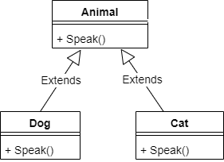
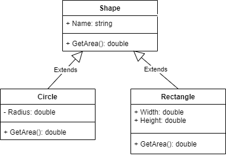
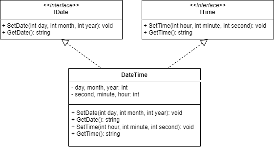

# Đa hình

Polymorphism

---

## Dẫn nhập

Giả sử cần viết ứng dụng quản lý một danh sách động vật gồm nhiều loài khác nhau (chó, mèo, dê, gà, cừu ...). Với mỗi loài đều cần có hành động phát ra tiếng kêu, tuy nhiên cách thức phát ra tiếng kêu của mỗi loài lại khác nhau.

Câu hỏi: Có thể cài đặt phương thức giống nhau `Speak()` sao cho khi thêm một con vật mới vào danh sách, tùy theo nó thuộc loài nào mà phương thức `Speak()` sẽ thực thi đoạn code phát ra tiếng kêu phù hợp?

Vấn đề này có thể giải quyết hiệu quả bằng kỹ thuật đa hình (polymorphism).

## Kỹ thuật đa hình

- Đa hình là một trong bốn đặc trưng quan trọng nhất của phương pháp lập trình hướng đối tượng (bao gồm: trừu tượng hóa (abstraction), bao đóng (encapsulation), thừa kế (inheritance) và đa hình (polymorphism)). Có hai loại đa hình: đa hình tĩnh ([nạp chồng phương thức](https://nd-hung.github.io/oop/topics/classes-and-objects/#nap-chong-phuong-thuc-method-overloading), [nạp chồng toán tử](https://nd-hung.github.io/oop/topics/classes-and-objects/#nap-chong-toan-tu-operator-overloading)) và đa hình động (ghi đè phương thức).

- Hai đặc điểm mấu chốt của đa hình động:

    Tại thời điểm chạy ứng dụng, các đối tượng của lớp con có thể được xử lý như là đối tượng của lớp cha. Nói cách khác, một đối tượng của lớp cha có thể giữ một đối tượng của lớp con và gọi phương thức của lớp con đó. Khi đó, kiểu dữ liệu của đối tượng lúc khai báo và lúc thực thi chương trình là khác nhau.

    Ở lớp cơ sở có thể cài đặt các phương thức ảo (virtual methods), ở các lớp dẫn xuất sẽ cài đặt các phương thức ghi đè (override methods). Khi chạy ứng dụng, trình điều khiển thực thi CLR (Common Language Runtime) sẽ gọi phương thức ghi đè của lớp con.

- Có thể cài đặt cơ chế đa hình bằng kỹ thuật thừa kế hoặc cài đặt giao diện (interface).

Cơ chế đa hình cho phép cài đặt một cách nhất quán các phương thức giống nhau của các lớp đối tượng khác nhau thông qua hai bước sau:

1. Tạo một lớp cơ sở chung của các loại đối tượng có liên quan với nhau. Sau đó cài đặt từng lớp dẫn xuất phù hợp với loại đối tượng cụ thể. Ở lớp cơ sở tạo phương thức ảo (virtual method), ở lớp dẫn xuất tạo phương thức ghi đè (override method).

2. Từ đối tượng của lớp cơ sở sử dụng phương thức ảo để gọi phương thức ghi đè ở lớp dẫn xuất.

### Cú pháp

```c#
// Bước 1: Cài đặt các lớp có mối quan hệ thừa kế
// Tạo lớp cơ sở
class BaseClass
{
    // Tạo phương thức ảo
    public virtual MethodName([<Danh sách tham số>])
    {
        // Các lệnh của phương thức ảo
    }
}

// Tạo các lớp thừa kế
class DerivedClass : BaseClass
{
    // Tạo phương thức ghi đè
    public override MethodName([<Danh sách tham số>])
    {
        // Các lệnh của phương thức ghi đè
    }
}

// Bước 2: Sử dụng phương thức đa hình
class Program
{
    public static void Main()
    {
        // Tạo đối tượng thuộc lớp cơ sở và khởi tạo là đối tượng của lớp thừa kế
        BaseClass obj = new DerivedClass();
        // Gọi phương thức đa hình từ đối tượng của lớp cơ sở
        obj.MethodName();
    }
}
```

## Ví dụ

### Ví dụ 1



Với bài toán quản lý động vật ở phần [dẫn nhập](#dan-nhap), ta cần xây dựng lớp cơ sở Animal với phương thức ảo (virtual method) có tên
`Speak()`. Sau đó, trong mỗi lớp kế thừa lớp Animal đều cài đặt phương thức trùng tên ghi đè (override) lên phương thức của lớp cơ sở.

Trong chương trình chính, khai báo biến `animals` để chứa danh sách các con vật tổng quát (`Animal`). Mỗi khi thêm một con vật cụ thể (`Dog`/`Cat`) vào danh sách thì phương thức thiết lập của lớp tương ứng sẽ được gọi để khởi tạo đối tượng.

Khi duyệt từng đối tượng và gọi phương thức `Speak()`, tùy theo loại cụ thể của đối tượng mà đoạn code ở trong phương thức ghi đè sẽ được thực hiện.

```c#
// Tạo lớp cơ sở Animal mô quả động vật tổng quát
public class Animal
{
    public string Name;

    // Constructor
    public Animal(string name = "")
    {
        Name = name;
    }
    // Tạo phương thức ảo (virtual) phát ra tiếng kêu
    public virtual void Speak()
    {
        Console.WriteLine("Hello, I'm an animal.");
    }
}

// Tạo lớp dẫn xuất Dog kế thừa lớp Animal
public class Dog : Animal
{
    // Constructor
    public Dog(string name = "") : base(name) { }
    // Tạo phương thức ghi đè (override) phát ra tiếng kêu của loài chó
    public override void Speak()
    {
        Console.WriteLine("Wufwuf, I'm a dog. My name is " + Name);
    }
}

// Tạo lớp dẫn xuất Cat kế thừa lớp Animal
public class Cat : Animal
{
    // Constructor
    public Cat(string name = "") : base(name) { }

    // Tạo phương thức ghi đè (override) phát ra tiếng kêu của loài mèo
    public override void Speak()
    {
        Console.WriteLine("Meow, I'm a cat. My name is " + Name);
    }
}

// Chương trình chính
public class DemoPolymorphism
{
    public static void Main()
    {
        // Tạo một danh sách loài vật
        var animals = new List<Animal>
        {
            new Dog("Shiba"),
            new Cat("Tom"),
            new Cat("Doreamon"),
            new Dog("Tyke")
        };

        // Gọi phương thức phát tiếng kêu của mỗi con vật
        foreach (var pet in animals)
        {
            pet.Speak();
        }
    }
}

/* Output
Wufwuf, I'm a dog. My name is Shiba
Meow, I'm a cat. My name is Tom
Meow, I'm a cat. My name is Doreamon
Wufwuf, I'm a dog. My name is Tyke
*/
```

Ta thấy, cơ chế đa hình không những hỗ trợ tái sử dụng mã nguồn triệt để mà còn giúp cài đặt một cách nhất quán các phương thức giống nhau về hành động nhưng khác nhau về cách thức. Hơn nữa, khi cần bổ sung một lớp dẫn xuất mới (ở đây là bổ sung một loài vật mới: bò, dê, cừu...) thì không phải sửa đổi mã nguồn đã có.

### Ví dụ 2

Viết chương trình sao cho khi chạy cho phép tạo các hình khác nhau (vuông, tròn, tam giác,...), sau đó tìm hình vẽ có diện tích lớn nhất.

Cách giải quyết bài toán này tương tự [Ví dụ 1](#vi-du-1). Trước hết tạo lớp cơ sở Shape có phương thức ảo `GetArea()` để tính diện tích hình vẽ. Do Shape là lớp tổng quát, chưa biết hình vẽ cụ thể nên không tính được diện tích, vì thế ta cho kết quả trả về là `0`. Ở lớp dẫn xuất Circle có phương thức ghi đè `GetArea()`, ở đây đã biết loại hình vẽ cụ thể (hình tròn) nên tính được diện tích của nó. Tương tự như vậy với lớp dẫn xuất Rectangle (hình chữ nhật).

Trong chương trình chính tạo danh sách đối tượng thuộc lớp Shape nhưng khởi tạo thành một trong hai loại đối tượng khác nhau của lớp Circle và lớp Rectangle. Ta thấy, khi gọi phương thức tính diện tích của mỗi đối tượng, tùy theo kiểu của đối tượng cụ thể được tạo ra (hình tròn, hình chữ nhật) mà các dòng lệnh tính diện tích phù hợp được gọi.



([Xem trên GitHub](https://github.com/nd-hung/oop/tree/main/docs/topics/polymorphism/code/Shape/))

```c#
// Tạo lớp hình vẽ tổng quát (Shape)
public class Shape
{
    // Phương thức ảo tính diện tích
    // Shape không phải hình vẽ cụ thể, nên không tính được diện tích
    public virtual double GetArea()
    {
        return 0;
    }
}// Kết thúc lớp Shape

// Tạo lớp hình tròn (Circle) kế thừa lớp hình vẽ
public class Circle : Shape
{
    public double Radius;   // Thuộc tính lưu độ dài bán kính

    // Constructor
    public Circle(double r = 0)
    {
        Radius = r;
    }

    // Phương thức ghi đè (override) tính diện tích hình tròn
    public override double GetArea()
    {
        return Math.PI * Radius * Radius;
    }
}// Kết thúc lớp Circle

// Lớp hình chữ nhật (Rectangle) kế thừa lớp hình vẽ
public class Rectangle : Shape
{
    public double Width;    // Các thuộc tính lưu kích thước hình chữ nhật
    public double Height;

    // Constructor
    public Rectangle(double w = 0, double h = 0)
    {
        Width = w;
        Height = h;
    }

    // Phương thức ghi đè tính diện tích hình chữ nhật
    public override double GetArea()
    {
        return Width * Height;
    }
} // Kết thúc lớp Rectangle

// Chương trình chính
class Program
{
    public static void Main()
    {
        // Tạo một danh dách các hình vẽ khác nhau
        var shapes = new List<Shape>
        {
            new Rectangle(9,6), // Hình chữ nhật (độ dài các cạnh)
            new Circle(1),      // Hình tròn (bán kính)
            new Circle(2.5),
            new Rectangle(6,9),
            new Circle(2.3)
        };

        // In thông tin của mỗi hình & tìm diện tích lớn nhất
        double maxArea = 0;
        foreach (var s in shapes)
        {
            Console.WriteLine("This is a {0}, area = {1:0.000}", s.GetType(), s.GetArea());
            if (s.GetArea() > maxArea) maxArea = s.GetArea();
        }

        // In thông tin (các) hình vẽ có diện tích lớn nhất
        Console.WriteLine("Cac hinh ve co dien tich lon nhat:");
        for (int i = 0; i < shapes.Count; i++)
            if (shapes[i].GetArea() == maxArea)
            {
                Console.WriteLine("Index = {0}, type: {1}, area = {2:0.000}", i, shapes[i].GetType(), shapes[i].GetArea());
            }
    }
}

/* Output
This is a Rectangle, area = 54.000
This is a Circle, area = 3.142
This is a Circle, area = 19.635
This is a Rectangle, area = 54.000
This is a Circle, area = 16.619
Cac hinh ve co dien tich lon nhat:
Index = 0, type: Rectangle, area = 54.000
Index = 3, type: Rectangle, area = 54.000
*/
```

## Lớp trừu tượng, phương thức trừu tượng

- Khi tạo một lớp với mục đích dùng làm lớp cơ sở cho các lớp khác mà chưa phải là một lớp đầy đủ, ta có thể thiết lập lớp này là lớp trừu tượng (abstract class).
- Lớp trừu tượng có thể chứa: phương thức trừu tượng hoặc phương thức cụ thể, các thuộc tính, phương thức thiết lập.
- Phương thức trừu tượng khai báo như khuôn mẫu hàm (không có thân hàm), thay từ khóa `virtual` bằng `abstract` trước kiểu trả về của phương thức.
- Ở các lớp dẫn xuất cần phải cài đặt chi tiết các phương thức trừu tượng đã khai báo ở lớp cơ sở.
- Lớp dẫn xuất chỉ được kế thừa một lớp trừu tượng.
- Có thể thiết lập phương thức, thuộc tính, sự kiện ảo; không thể thiết lập các trường dữ liệu (fields) ảo.

### Cú pháp tạo lớp trừu tượng, phương thức trừu tượng

```c#
// Tạo lớp trừu tượng
abstract class AbstractClass
{
    // Tạo phương thức trừu tượng (giống như khai báo khuôn mẫu hàm)
    [<access modifier>] abstract MethodName([<Danh sách tham số>]);
}

// Tạo các lớp thừa kế
class DerivedClass : AbstractClass
{
    // Tạo phương thức ghi đè
    [<access modifier>] override MethodName([<Danh sách tham số>])
    {
        // Các lệnh của phương thức ghi đè
    }
}
```

### Ví dụ:

```c#
// Tạo lớp trừu tượng Animal mô quả động vật tổng quát
public abstract class Animal
{
    public string Name;

    // Constructor
    public Animal(string name = "")
    {
        Name = name;
    }
    // Tạo phương thức trừu tượng (abstract) 
    public abstract void Speak();
}

// Tạo lớp dẫn xuất Dog kế thừa lớp trừu tượng Animal
public class Dog : Animal
{
    // Constructor
    public Dog(string name = "") : base(name) { }
    // Tạo phương thức ghi đè (override) phát ra tiếng kêu của loài chó
    public override void Speak()
    {
        Console.WriteLine("Wufwuf, I'm a dog. My name is " + Name);
    }
}

// Chương trình chính
public class DemoAbstractClass
{
    public static void Main()
    {
        // Khởi tạo đối tượng của lớp trừu tượng -> không thực hiện được:
        // Error CS0144: Cannot create an instance of the abstract type or interface 'Animal`
        Animal animal = new Animal("I'm an animal.");

        // Khai báo đối tượng thuộc kiểu Animal và khởi tạo là đối tượng thuộc kiểu dẫn xuất -> thực hiện được:
        Animal dog = new Dog("I'm a dog, my name is Spike.");
    }
}
```

## Sự khác nhau giữa từ khóa `new` và `override`

- Sử dụng từ khóa `new` trước kiểu trả về của định nghĩa phương thức ở lớp con khi muốn ẩn phương thức cùng tên ở lớp cha.
- Sử dụng từ khóa `override` trước kiểu trả về của định nghĩa phương thức ở lớp con khi muốn cài đặt mở rộng thức cùng tên ở lớp cha. Phương thức cùng tên ở lớp cha cần có từ khóa `virtual` hoặc `abstract` trước kiểu trả về.

## Giao diện (interface)

- Giao diện là một lớp chỉ chứa các phương thức trừu tượng (abstract methods), các thuộc tính (properites) chưa cài đặt chi tiết.
- Các lớp cài đặt bắt buộc phải cài đặt mọi thành phần được khai báo trong interface (lớp cài đặt có thể có thêm các thuộc tính, phương thức mới).
- Một lớp có thể cài đặt (kế thừa) nhiều giao diện.
- Quy ước đặt tên interface bắt đầu bằng ký tự `I`.

> Chú ý:

> Trong các phiên bản C# trước 8.0, giao diện được thiết kế như là lớp trừu tượng chỉ có các thành phần trừu tượng. Lớp cài đặt phải viết mã nguồn đầy đủ cho tất cả thành phần của giao diện.
> Từ phiên bản 8.0 trở đi, giao diện có thể có phần cài đặt mặc định cho một số hoặc toàn bộ thành viên; lớp kế thừa không bắt buộc phải cài đặt thành phần đã được cài đặt mặc định.


### Ví dụ

```c#
// Tạo interface khai báo các thuộc tính, phương thức của động vật tổng quát
public interface IAnimal
{
    public string Name {get;set; }  // Lớp kế thừa phải cài đặt thuộc tính này

    // Lớp kế thừa phải cài đặt phương thức này
    void Speak();
}

// Tạo lớp dẫn xuất Dog cài đặt giao diện IAnimal
public class Dog : IAnimal
{
    public string Name { get; set; }

    public Dog(string name)
    {
        Name = name;
    }
    // Cài đặt chi tiết phương thức phát ra tiếng kêu
    public void Speak()
    {
        Console.WriteLine("Hello I'm a {0}, my name is {1}", this.GetType(), Name);
    }
}

// Chương trình chính
public class TestInterface
{
    public static void Main()
    {
        // IAnimal dog0 = new IAnimal(); // -> Lỗi biên dịch CS0144 Cannot create an instance of the abstract type or interface 'IAnimal'
        IAnimal dog1 = new Dog("Spike"); // OK
        dog1.Speak();
        Dog dog2 = new Dog("Shiba");     // OK
        dog2.Speak();
    }
}

/* Output
Hello I'm a Dog, my name is Spike
Hello I'm a Dog, my name is Shiba
*/
```

## Đa thừa kế

- Đa thừa kế là việc một lớp có thể kế thừa đồng thời từ nhiều lớp khác nhau.
- Ngôn ngữ C# không hỗ trợ trực tiếp đa thừa kế; một lớp chỉ được phép kế thừa một lớp cơ sở.
- Trong C#, một lớp có thể cài đặt (kế thừa) nhiều interface, vì thế có thể khai thác đặc điểm này để giải quyết phần nào vấn đề đa thừa kế.

### Ví dụ:

Cài đặt lớp DateTime để quản lý ngày giờ. Lớp DateTime cài đặt từ hai interface IDate và ITime.



[Xem trên GitHub](https://github.com/nd-hung/oop/tree/main/docs/topics/polymorphism/code/MultipleInheritance)

```c#
// Tạo interface IDate xử lý ngày tháng
interface IDate
{
    // Định nghĩa khuôn mẫu phương thức lấy ngày tháng năm
    public string GetDate();

    // Định nghĩa khuôn mẫu phương thức đặt ngày tháng năm
    public void SetDate(int day, int month, int year);
}

// Tạo interface ITime xử lý giờ phút
interface ITime
{
    // Định nghĩa khuôn mẫu phương thức lấy giờ phút giây
    public string GetTime();

    // Định nghĩa khuôn mẫu phương thức đặt giờ phút giây
    public void SetTime(int hour=0, int minute=0, int second=0);
}

// Tạo lớp MyDateTime cài đặt các giao diện IDate, ITime
class MyDateTime: IDate, ITime
{
    // Các trường dữ liệu (fields) riêng của lớp
    private int day, month, year;
    private int second, minute, hour;

    // Cài đặt phương thức GetDate
    public string GetDate()
    {
        return $"{day}/{month}/{year}"; 
    }

    // Cài đặt phương thức SetDate
    public void SetDate(int day, int month, int year)
    {
        if (isValidDate(day, month, year))
        {
            this.day = day;
            this.month = month;
            this.year = year;
        }
    }

    // Cài đặt phương thức GetTime
    public string GetTime()
    {
        return $"{hour}:{minute}:{second}";
    }

    // Cài đặt phương thức SetTime
    public void SetTime(int hour=0, int minute=0, int second=0)
    {
        if(isValidTime(hour, minute, second))
        {
            this.hour = hour;
            this.minute = minute;
            this.second = second;
        }
    }

    // Phương thức trả về chuỗi chứa ngày giờ
    // Dùng từ khóa override để ghi đè phương thức ToString()
    public override string ToString()
    {
        if (isValidDate(day, month, year) && isValidTime(hour, minute, second))
            return $"{day:00}/{month:00}/{year:0000}-{hour:00}:{minute:00}:{second:00}";
        else return $"Invalid date or time";
    }

    // Hàm tiện ích kiểm tra ngày tháng có hợp lệ hay không
    static bool isValidDate(int day, int month, int year)
    {
        bool isValid = true;
        if(year < 1 || day < 1 || day > 31 || month < 1 || month > 12) return false;
        switch(month) 
        { 
            case 1: case 3: case 5: case 7: case 8: case 10: case 12:
                if(day > 31) isValid = false; break;
            case 4: case 6: case 9: case 11:
                if (day > 30) isValid = false; break;
            case 2:
                {
                    if ((year % 400 == 0) || (year % 4 == 0 && year % 100 != 0))
                    {
                        if (day > 29) isValid = false;
                    }
                    else
                    {
                        if (day > 28) isValid = false;
                    }
                    break;
                }
        }
        return isValid;
    }

    // Hàm tiện ích kiểm tra thời gian hợp lệ
    static bool isValidTime(int hour, int minute, int second)
    {
        return (hour >= 0 && hour <= 23 && minute >= 0 && minute <= 59 && second >= 0 && second <= 59);
    }
}

class Program
{
    public static void Main()
    {
        var dt1 = new MyDateTime();
        dt1.SetDate(29, 2, 2020); // Phương thức SetDate của giao diện IDate
        dt1.SetTime(5, 37, 08);   // Phương thức SetTime của giao diện ITime
        Console.WriteLine(dt1);   // Output: 29/02/2020-05:37:08

        var dt2 = new MyDateTime();
        dt2.SetDate(29, 2, 2023); 
        dt2.SetTime(26, 8, 7);   
        Console.WriteLine(dt2);    // Output: Invalid date or time
    }
}
```

### Cài đặt nhiều giao diện trùng phương thức

- Khi một lớp cài đặt hai interface có chứa phương thức trùng nhau thì cả hai giao diện này đều sử dụng được phương thức cài đặt này.
- Ví dụ:

```c#
interface IDate
{
    public void Print();
}

interface ITime
{
    public void Print();
}

// Lớp MyDateTime cài đặt các giao diện IDate, ITime
class MyDateTime : IDate, ITime
{
    // Các trường dữ liệu (fields) riêng của lớp
    private int day, month, year;
    private int second, minute, hour;

    // Constructor
    public MyDateTime(int day, int month, int year, int hour, int minute=0, int second=0)
    {
        this.day = day;
        this.month = month; 
        this.year = year;
        this.hour = hour;
        this.minute = minute;
        this.second = second;
    }

    public void Print()
    {
        Console.WriteLine($"{day:00}/{month:00}/{year:0000}-{hour:00}:{minute:00}:{second:00}");
    }
}

class Program
{
    public static void Main()
    {
        MyDateTime dt1 = new MyDateTime(6,4,2023,14,23);
        dt1.Print(); // Output: 06/04/2023-14:23:00

        IDate dt2 = new MyDateTime(2,9,1945,15,20);
        dt2.Print(); // Output: 02/09/1945-15:20:00

        ITime dt3 = new MyDateTime(7, 5, 1954, 17, 0);
        dt3.Print(); // Output: 07/05/1954-17:00:00
    }
}
```

Trong ví dụ trên, cả hai interface IDate và ITime đều có phương thức Print(); lớp MyDateTime cài đặt cả 2 giao diện này nhưng chỉ có 1 phương thức Print() trong lớp. Trong chương trình chính, tạo 3 đối tượng dt1, dt2, dt3 theo 3 cách khác nhau. Sau đó, cho từng đối tượng gọi phương thức Print() thì cả 3 đều gọi đến phương thức trùng tên ở lớp MyDateTime.

Khi muốn phương thức trùng tên ở các interface ứng xử khác nhau thì trong lớp cài đặt phải viết tường minh. Quay lại ví dụ trên, giả sử ta muốn phương thức Print() của giao diện IDate in ra ngày tháng năm, còn phương thức Print() của giao diện ITime in ra giờ phút giây. Ta cần cài đặt tường minh ở lớp kế thừa như sau:

```c#
interface IDate
{
    public void Print();
}

interface ITime
{
    public void Print();
}

// Lớp MyDateTime cài đặt các giao diện IDate, ITime
class MyDateTime : IDate, ITime
{
    // Các trường dữ liệu (fields) riêng của lớp
    private int day, month, year;
    private int second, minute, hour;

    // Constructor
    public MyDateTime(int day, int month, int year, int hour, int minute=0, int second=0)
    {
        this.day = day;
        this.month = month; 
        this.year = year;
        this.hour = hour;
        this.minute = minute;
        this.second = second;
    }

    // Cài đặt phương thức Print() của giao diện IDate
    void IDate.Print()
    {
        Console.WriteLine($"{day:00}/{month:00}/{year:0000}");
    }

    // Cài đặt phương thức Print() của giao diện ITime
    void ITime.Print()
    {
        Console.WriteLine($"{hour:00}:{minute:00}:{second:00}");
    }

    // Cài đặt phương thức chung Print() 
    public void Print()
    {
        Console.WriteLine($"{day:00}/{month:00}/{year:0000}-{hour:00}:{minute:00}:{second:00}");
    }
}

class Program
{
    public static void Main()
    {
        MyDateTime dt1 = new MyDateTime(6,4,2023,14,23);
        dt1.Print();    // Output: 06/04/2023-14:23:00

        IDate dt2 = new MyDateTime(2,9,1945,15,20);
        dt2.Print();    // Output: 02/09/1945

        ITime dt3 = new MyDateTime(7, 5, 1954, 17, 0);
        dt3.Print();    // Output: 17:00:00
    }
}
```

Trong đoạn code trên, đối tượng dt1 được khai báo thuộc lớp MyDateTime nên khi gọi phương thức dt1.Print() thì phương thức chung Print() được gọi; đối tượng dt2 được khai báo thuộc giao diện IDate nên khi gọi phương thức dt2.Print() thì phương thức IDate.Print() được thực thi; đối tượng dt3 được khai báo thuộc giao diện ITime nên khi gọi phương thức dt3.Print() thì phương thức ITime.Print() được thực hiện.
